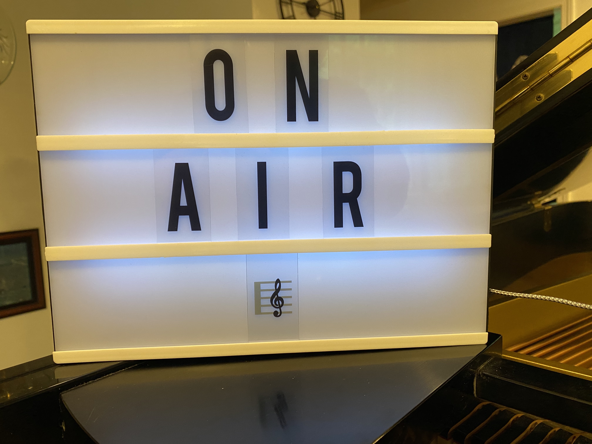

# Piano Sound Visualizer

  </a> 
  </a>

This is a RasPi-based device that continuously "hears" (records) ambient piano sound and emits 90 LED lights according to its pitch. 

See these [presentation slides](https://docs.google.com/presentation/d/1whfZ7a1xyZ1jbx8g7n9CZ_9gnKFk6cfis5jTRGf3fbg/edit?usp=sharing) for more details about what kind of parts to purchase and how to set up hardware and software.

## Demo videos

https://github.com/HSSBoston/piano-vizualizer/assets/74394277/b6b7a375-8aa7-46ec-8ee5-66d52a345366

https://github.com/HSSBoston/piano-vizualizer/assets/74394277/60aaf9d4-ed8b-4215-9557-653f0d9aa38e

https://github.com/HSSBoston/piano-vizualizer/assets/74394277/8dde6584-74c9-4d54-8b7d-05b53d8d8c5c

